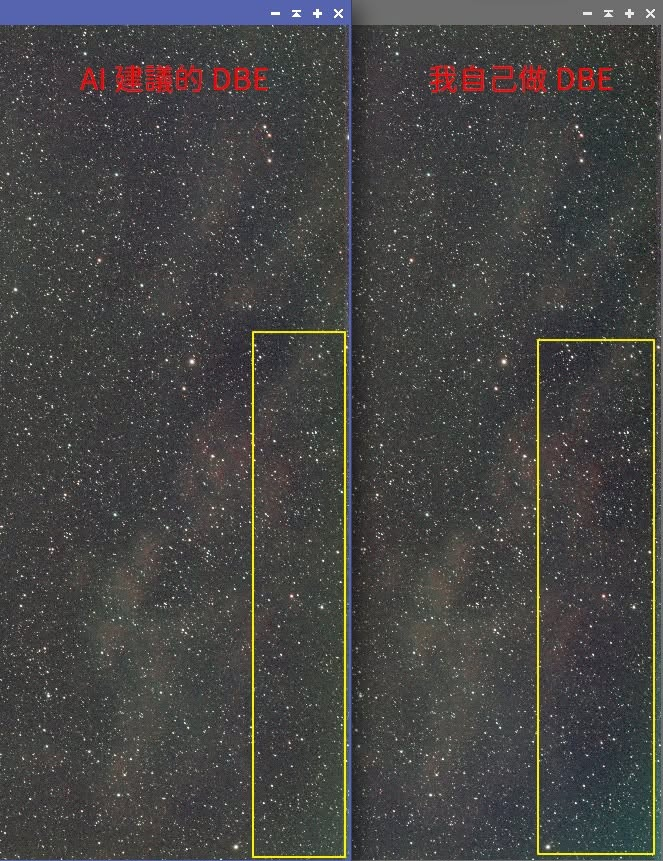
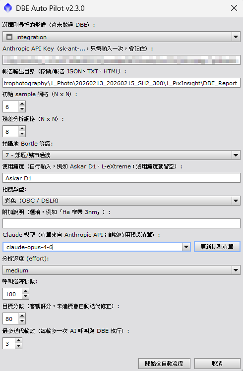
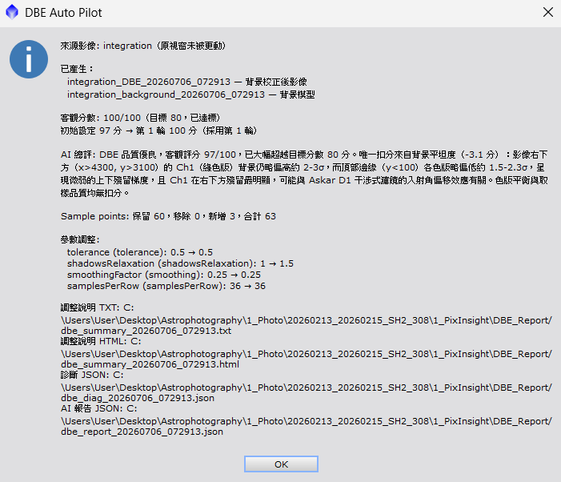

# DBE Auto Pilot

PixInsight 的 AI 輔助全自動背景梯度校正工具。
從剛疊好的線性影像開始，一鍵完成：

```
自動佈點初始 DBE → 殘差量測 → Claude AI 分析梯度 → 套用建議 → 最終 DBE → 客觀評分驗證（未達標自動迭代修正）
```

純 PJSR 實作，**不需要安裝 Python**；AI 只分析統計數據並建議取樣點與參數，
影像像素僅經 PixInsight DynamicBackgroundExtraction（2D surface spline）
古典演算法處理，**無任何生成式處理**。

## 安裝

1. PixInsight → **Resources → Updates → Manage Repositories** → **Add**，貼上：

   ```
   https://conan0312.github.io/dbe-updates/
   ```

2. **Resources → Updates → Check for Updates** → 安裝 → 重新啟動 PixInsight
3. Script 選單出現 **DBEAutoPilot**

## 使用

1. 準備一組 [Anthropic API Key](https://console.anthropic.com/)（`sk-ant-...`）
2. 開啟剛疊好的影像，執行 **Script → DBEAutoPilot**
3. 對話框中選擇影像、輸入 API Key（只需一次，會記住）、
   設定 Bortle 等級與使用的濾鏡，按「開始全自動流程」
4. 完成後產生兩個新視窗（原始影像不會被更動）：
   - `<影像>_DBE_<時間戳>` — 背景校正後影像
   - `<影像>_background_<時間戳>` — 背景模型（應為平滑漸層；
     若出現雲氣形狀代表扣到真實訊號，請用「附加說明」欄位告知 AI 該區域是真訊號後重跑）
5. 報告輸出到 `<家目錄>/DBEAutoPilot/`（可在對話框修改）：
   - `dbe_summary_*.txt` / `.html` — 人類可讀的完整調整說明
     （量測數據 → AI 判斷理由 → 每項參數調整依據，含 DBE 介面位置對應）
   - `dbe_diag_*.json` / `dbe_report_*.json` — 原始診斷與 AI 建議
     （迭代輪次帶 `_r2`、`_r3` 後綴；可作為後製流程紀錄，供攝影比賽評審備查）

## 與自己手動做 DBE 的差異

| | 手動 DBE | DBE Auto Pilot |
|---|---|---|
| 取樣點選位 | 人眼判斷背景位置，容易誤放在微弱星雲/星暈上而不自知 | 演算法在每個佈點位置的 9 宮格範圍找「局部最暗處」，再與周邊大範圍背景比對，疑似污染的點自動降權 |
| 邊緣與角落 | 常忽略貼邊取樣，spline 在最外圈取樣點之外只能外插，邊緣梯度最容易殘留 | 固定沿距邊 2.5% 處加放一圈貼邊點（含四角） |
| 參數設定 | tolerance / smoothing 等靠經驗與試錯 | AI 依 Bortle 等級、濾鏡特性（含干涉式濾鏡入射角效應）、殘差數據給出參數建議 |
| 結果驗證 | 目視判斷「看起來平了沒」 | 對校正結果重新量測並算客觀分數，未達標自動帶數據請 AI 修正重跑 |
| 可重現性 | 無紀錄，下次重做結果不同 | 完整診斷/建議 JSON 與調整說明報告，每一步有量測依據 |

實測差異範例（SH2-308，Bortle 7 + Askar D1，同一張疊圖）：手動 DBE 的成品在
影像右側邊緣殘留一條綠色（Ch1）梯度帶（下圖右側黃框）——那正是人眼最難察覺、
又最容易漏放取樣點的貼邊區域；Auto Pilot 版（下圖左）因貼邊圈 + AI 針對 Ch1
偏移點位的微調，同區域乾淨無色偏。完整的實際執行報告見 [Sample/](Sample/) 資料夾。



## 全自動 DBE 的邏輯

1. **自動佈點**：影像內部佈 N×N 網格點（避開 8% 邊界）+ 沿四周距邊 2.5%
   一圈貼邊點（含四角）。每個點在 9 宮格內找局部最暗位置取樣（背景是局部
   最暗的平滑處），取半徑內各色版「中位數」抗星點干擾；取樣值再與周邊
   4 倍半徑範圍比對，偏高（疑似落在星雲/星暈）的色版自動降權。
2. **初始 DBE**：在原圖複製品上執行，取得初步背景模型（原圖全程不動）。
3. **殘差量測**：計算「原圖 − 初步模型」逐格統計，連同取樣點分佈品質、
   拍攝條件（Bortle、濾鏡、相機類型）與客觀分數組成診斷資料。
4. **AI 分析**：診斷資料送 Claude API，取得問題清單、取樣點增/刪/移建議
   與參數建議（AI 不評分、不碰像素，只讀統計數據）。
5. **套用與執行**：依建議改寫取樣點表與參數，在原圖的新複製品上執行最終
   DBE（Subtraction + Normalize）。
6. **驗證與迭代**：對校正後影像**重新自動佈點取樣**，量測「背景取樣點
   背景值的離散度」算出客觀分數。達標（預設 80）即完成；未達標把驗證數據
   （含背景偏移最大的點位座標）回饋給 AI 再修正、重跑，最多 N 輪（預設 3），
   最後保留分數最高的一輪，其餘視窗自動關閉。

## 評分項目計算標準

分數由腳本以**固定公式**計算（AI 只解讀不評分），同一份數據分數固定，
跨模型、跨次執行可直接比較。基準單位為影像像素雜訊
sigma（各通道 MAD × 1.4826 取中位數）。

| 分項 | 滿額 | 量測方式 | 扣分規則 |
|---|---|---|---|
| 背景平坦度 | 55 | 各色版「背景取樣點背景值」的修剪峰谷差（修剪最高/最低各 2 點抗離群），取最差色版 | 峰谷差 ≤ 3σ 不扣分，之後每 1σ 扣 2.5 分，扣完為止 |
| 色版平衡 | 25 | 每個取樣點「各色版相對該色版全體中位數的偏移」極差，取修剪後最大值 | ≤ 2σ 不扣分，每 1σ 扣 2.5 分 |
| 取樣品質 | 20 | 空象限（每個 -3，上限 -8）、均勻性（<0.3 扣 6 / <0.5 扣 3）、邊緣覆蓋率（偏離 0.25-0.6 扣 3）、低權重點比例（>25% 扣 6 / >10% 扣 3） | 合計上限 -20 |

設計要點：

- **量取樣點、不量殘差網格**——殘差網格的逐格統計會被大尺度星雲訊號整格
  墊高（那是不該被 DBE 扣掉的真實訊號）。實測 SH2-308 疊圖：殘差網格峰谷差
  在校正前後都停在 ~40σ，若拿它評分會永遠卡在 20 分；取樣點是特地尋找的
  局部最暗乾淨背景，同一張圖校正前 4.2σ → 校正後 0.4σ，能正確反映校正品質。
- 疑似污染（任一色版權重 < 1）的取樣點不列入平坦度/色版統計，改由取樣品質
  分項與 AI 建議處理。
- 預設目標 80 分、最多迭代 3 輪，皆可在對話框調整。

## 介面預覽

執行 **Script → DBEAutoPilot** 後的設定對話框（API Key 只需輸入一次；
目標分數與迭代輪數可自行調整）：



## 執行結果範例

全自動流程完成後的結果摘要（此例：初始設定 97 分 → 第 1 輪 100 分達標收工，
AI 同時指出唯一的輕微扣分來源與成因判斷）：



## 評分報告範例

實際執行產生的完整報告請詳閱 [Sample/](Sample/) 資料夾
（`dbe_summary_*.html`，含量測數據、客觀評分拆解、AI 判斷理由與每項調整依據）。

## Changelog & Releases

| 版本 | 日期 | 內容 |
|---|---|---|
| v2.3.0 | 2026-07-05 | 客觀評分改量「背景取樣點背景值離散度」：修正殘差網格統計被大尺度星雲訊號墊高、導致星雲滿佈的影像分數卡死無法達標的問題（實測同圖 20 分 → 校正後可達 100 分）。驗證不再需要多跑一次 DBE；迭代診斷改附背景偏移點位座標清單供 AI 精準定位 |
| v2.2.0 | 2026-07-05 | 評分客觀化：分數由固定公式計算（平坦度 55 + 色版平衡 25 + 取樣品質 20），AI 只解讀不評分，跨模型可比較。新增自動迭代：每輪 DBE 後重新量測，未達目標分數（預設 80）自動帶驗證數據請 AI 修正重跑（最多 3 輪，保留最高分輪次）；對話框新增目標分數與迭代輪數設定 |
| v2.1.3 | 2026-07-05 | 模型清單改用系統 curl 抓取：PixInsight 1.9 的 `NetworkTransfer.download()` 會忽略自訂 HTTP 標頭（`post()` 正常），導致 `/v1/models` 一律回 401；金鑰經暫存 config 檔傳遞不入程序列表 |
| v2.1.2 | 2026-07-05 | 修正自訂標頭傳遞方式與 POST 逾時預算（AI 生成 30~90 秒不再被 30 秒連線逾時切斷）；發佈檔名加入建置時間讓 PixInsight 能偵測同日更新 |
| v2.1.1 | 2026-07-05 | 顯示 libcurl 底層錯誤細節、明確啟用 SSL，改善連線問題診斷 |
| v2.1.0 | 2026-07-05 | 濾鏡改自由文字輸入、新增彩色/單色相機選項、模型下拉清單改接 `/v1/models` 即時清單（離線 fallback 預設清單）；移除混淆層改出貨可讀原始碼 |
| v2.0 | 2026-07-05 | 首個公開版：純 PJSR 一鍵全自動流程（自動佈點 → 初始 DBE → 殘差診斷 → Claude 分析 → 套用建議 → 最終 DBE），發佈拆分為公開 dbe-updates repo（GitHub Pages 更新源），原始碼 repo 轉私有 |

## 注意事項

- AI 分析約需 30~90 秒/輪，期間 PixInsight 介面凍結屬正常現象；
  每多一輪迭代多一次 AI 呼叫與 DBE 執行
- API 呼叫依 Anthropic 費率計費（預設 `claude-opus-4-6`，effort=medium）
